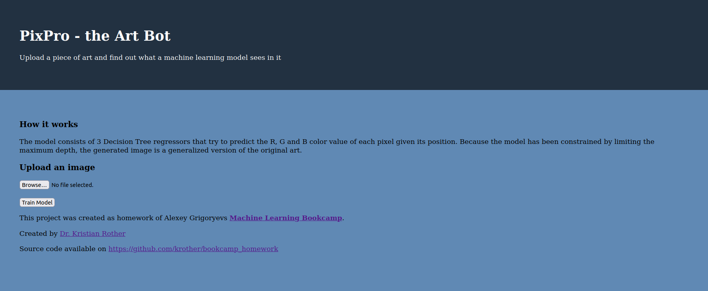
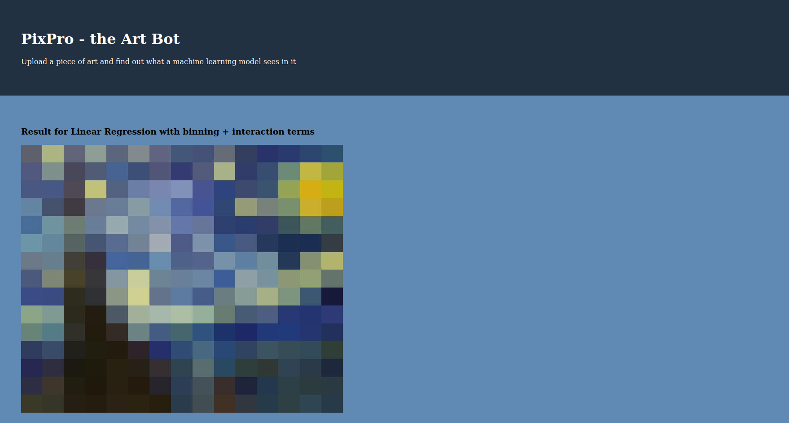

# PixPro - the Art Bot

*by Kristian Rother ([www.academis.eu](https://www.academis.eu))

### The Problem

In this project, I used Machine Learning to generate art. 
For example this one:

The algorithms extract the color values from an input image.
The data is wrangled in such a way that I end up with a table containing the x and y coordinates as the input features
and the color values as the target:

    x   y   red  green  blue
    0   0   243    123    65
    1   0   242    119    64
    ...

During the training, I trained three models: one for predicting the red color, one for green and one for blue.
The output is combined into a result image.

Pixpro comes with Flask website and a Docker container.

----

### How to run the project

You could install the dependencies and run the program with Flask locally:

    pipenv shell
    pipenv install
    pipenv run gunicorn app:app

or build and run a docker container:

    docker build -t pixpro .
    docker run -p 8000:8000 -d --name pixpro pixpro

In both cases go to `http://0.0.0.0:8000/` in your browser.

You should see the submission page:

Once you upload an image, the model trains for a while (try a smaller image first). Then it displays two images, one for a Linear Regression model, one for a Decision Tree.

The Jupyter notebook in the repo contains some EDA and attempts to use different models and playing with hyperparameters.

----

### Notes

The deployment with gunicornd does something to the image encoding that distorts the colors.
To run the development version, try:

    export FLASK_APP=app.py
    export FLASK_DEBUG=True
    flask run

----

**Have fun!**
